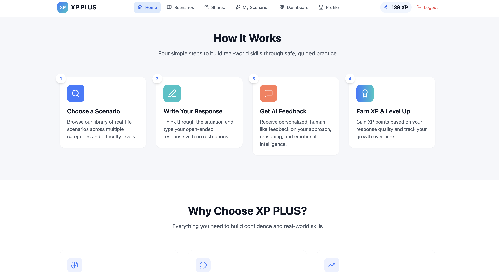
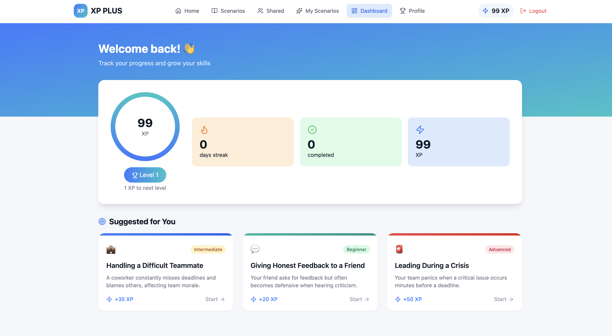
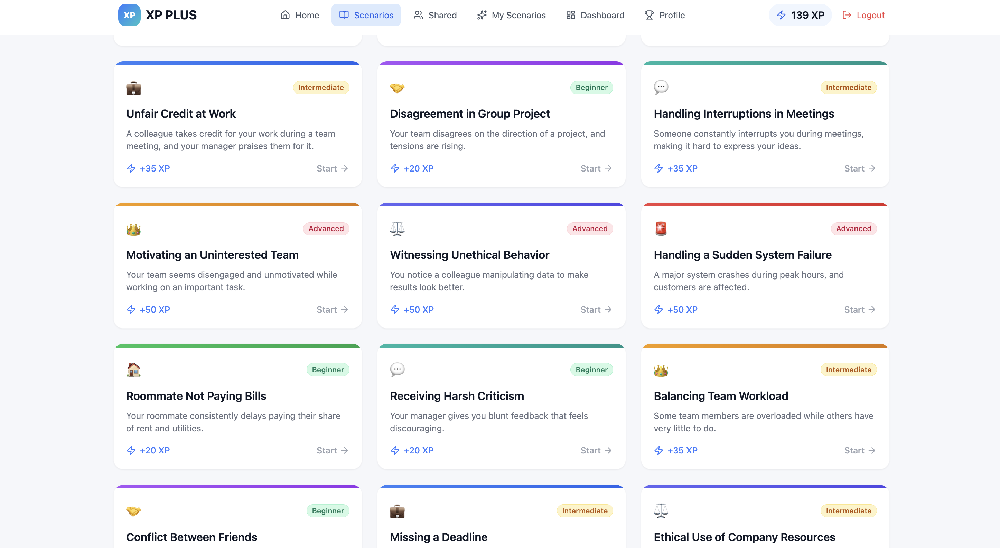
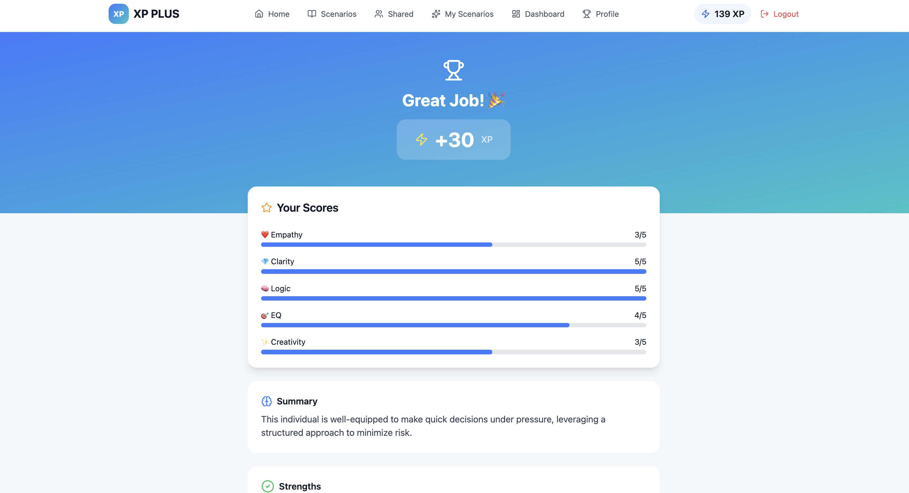
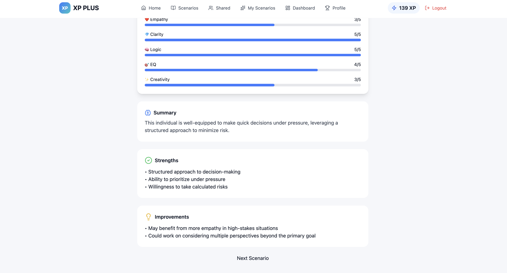

# 🚀 XP PLUS – AI-Powered Scenario Training Platform

XP PLUS is a full-stack web application that enables users to practice real-world scenarios and receive AI-generated feedback with gamified scoring (XP system).

It combines **behavioral training + AI evaluation + gamification + admin analytics** into one platform.

---

## 🌟 Features

### 👤 User Features

* Practice real-world scenarios (workplace, communication, leadership, etc.)
* Submit responses and receive **AI-based evaluation**
* Earn XP based on performance
* Create, edit, and delete custom scenarios
* Share scenarios with the community
* Clone public scenarios

---

### 👑 Admin Features

* View all users (email, role, XP, level)
* Monitor all user responses
* View AI feedback and scores
* Delete inappropriate responses
* Manage all scenarios (edit/delete)

---

### 🧠 AI Integration

* Evaluates responses using backend API
* Generates structured feedback:

  * Empathy
  * Clarity
  * Logic
  * Emotional Intelligence
  * Creativity

---

## 📸 Screenshots

### 🏠 Home / Dashboard  
Path: `/home`




---

### 📊 Dashboard  
Path: `/dashboard`



---

### 📚 Scenario Library  
Path: `/scenarios`



---

### 🧠 AI Feedback  
Path: `/scenario/:id`




---

## 🛠️ Tech Stack

**Frontend**

* React.js (Vite)
* Tailwind CSS
* Framer Motion

**Backend**

* Node.js + Express (AI evaluation API)

**Database & Auth**

* Firebase Firestore
* Firebase Authentication

---

## 🧠 System Architecture

Frontend (React) → Firebase (Auth + Firestore) → Node.js API → AI Evaluation → Response Scoring

- React handles UI & state
- Firebase manages authentication & database
- Node.js processes AI evaluation
- XP system gamifies learning

---

## 📁 Project Structure

```
xp-plus/
│
├── client/                # React frontend
│   ├── src/
│   │   ├── pages/
│   │   ├── components/
│   │   ├── lib/
│   │   └── data/
|   |   
│   │   ├── utils/
│   │   ├── layouts/
│   │   ├── entities/
│   │   └─

│
├── server/                # Backend (AI evaluation API)
│   └── index.js
│
└── README.md
```

---

# ⚙️ HOW TO RUN THE PROJECT (STEP-BY-STEP)

## 🔴 1. Clone the Repository

```bash
git clone https://github.com/your-username/xp-plus.git
cd xp-plus
```

---

## 🟡 2. Install Dependencies

### Frontend

```bash
cd client
npm install
```

### Backend

```bash
cd ../server
npm install
```

---

## 🔵 3. Setup Firebase

### Step 1: Go to Firebase Console

👉 https://console.firebase.google.com

### Step 2: Create a project

### Step 3: Enable:

* Authentication → Email/Password
* Firestore Database

---

### Step 4: Get Firebase Config

Go to:

```
Project Settings → General → Your Apps → Web App
```

Copy config:

```js
const firebaseConfig = {
  apiKey: "...",
  authDomain: "...",
  projectId: "...",
  storageBucket: "...",
  messagingSenderId: "...",
  appId: "...",
};
```

---

### Step 5: Add to your project

Create file:

```
client/src/lib/firebase.js
```

Paste:

```js
import { initializeApp } from "firebase/app";
import { getFirestore } from "firebase/firestore";
import { getAuth } from "firebase/auth";

const firebaseConfig = {
  apiKey: "...",
  authDomain: "...",
  projectId: "...",
};

const app = initializeApp(firebaseConfig);

export const db = getFirestore(app);
export const auth = getAuth(app);
```

---

## 🟣 4. Setup Firestore Rules

Go to Firestore → Rules → Paste:

```js
rules_version = '2';
service cloud.firestore {
  match /databases/{database}/documents {

    match /users/{userId} {
      allow read: if request.auth != null;
      allow write: if request.auth != null &&
        request.auth.uid == userId;
    }

    match /responses/{id} {
      allow read: if request.auth != null;
      allow create: if request.auth != null;

      allow delete: if request.auth != null &&
        get(/databases/$(database)/documents/users/$(request.auth.uid)).data.role == "admin";
    }

    match /scenarios/{id} {
      allow read: if true;

      allow create: if request.auth != null;

      allow update, delete: if request.auth != null &&
      (
        get(/databases/$(database)/documents/users/$(request.auth.uid)).data.role == "admin"
        ||
        resource.data.created_by == request.auth.uid
      );
    }
  }
}
```

👉 Click **Publish**

---

## 🟢 5. Setup Backend (AI Server)

Go to:

```
server/server.js
```

Make sure your API is running on:

```js
http://localhost:3001/api/evaluate
```

---

## ▶️ 6. Run the Project

### Start Backend

```bash
cd server
node server.js
```

---

### Start Frontend

```bash
cd client
npm run dev
```

---

## 🌐 7. Open in Browser

```
http://localhost:5173
```

---

# 👑 ADMIN SETUP (IMPORTANT)

After signup:

1. Go to Firestore → `users` collection
2. Find your user document
3. Add:

```json
{
  "role": "admin"
}
```

---

# 🧪 SAMPLE TEST FLOW

1. Sign up / Login
2. Create a scenario
3. Solve a scenario → get AI feedback + XP
4. Open `/admin` → view:

   * Users
   * Responses
   * Scenarios
5. Try deleting a response (admin only)

---

# ⚡ KEY HIGHLIGHTS

* Role-based access (admin vs user)
* AI-powered evaluation system
* Full CRUD for scenarios
* Firestore security rules
* Real-time data handling

---

# 📌 FUTURE IMPROVEMENTS

* Pagination in admin dashboard
* Leaderboard system
* AI model fine-tuning
* Deployment (Vercel + Firebase Hosting)

---

## 💼 Why This Project Matters

- Simulates real-world decision making scenarios
- Applies AI for behavioral evaluation
- Implements role-based access control
- Demonstrates full-stack system design
- Combines product thinking + engineering

---

# 👤 Author

**Adhisha Walia**
B.Tech CSE | MIT Bangalore

---

⭐ If you like this project, consider giving it a star!
